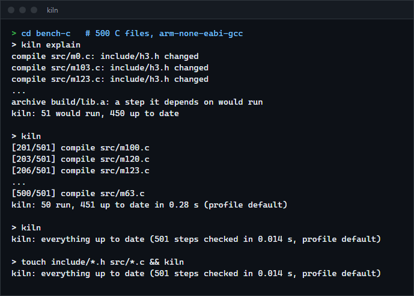

# kiln

A build system that decides what to rebuild from content hashes instead of timestamps. Tasks in a small TOML file expand into commands, the commands form a graph by the files they read and write, and a command runs again only when its own text or the content of something it reads has changed. For anyone who wants Ninja's speed with a file a person can write, and no rebuilds when a file is touched, checked out again or rewritten with the same bytes.

**Status:** v0.1.0, working on Windows (the Unix code paths are written but were not run). Not published to crates.io.



## Features

- **Content hashes, not timestamps.** A step's key is a BLAKE3 hash of its command, its output names, and the content hash of every input. Touching a file, switching branches and back, or restoring from a backup rebuilds nothing. File hashes are cached by modification time and size, so unchanged files are not read again.
- **Early cutoff.** A step's dependents decide after its outputs are hashed, so a step that runs again but writes the same bytes (a comment changed) stops the rebuild there.
- **Discovered dependencies** from Makefile-style depfiles (`gcc -MD`, `clang -MD`): headers need not be listed.
- **Tasks that expand per file:** `foreach = "src/**/*.c"` makes one step per match; `inputs = ["@compile"]` uses every output of another task. Globs support `*`, `?`, `**` and `[a-z]`.
- **Profiles:** `[profile.release]` overrides variables; outputs usually include `{profile}`, so profiles build side by side and switching back costs nothing.
- **Parallel** (`-j`, default one per logical CPU) on [workpool](https://github.com/r3clusionn/thread-pool-library), the portfolio's thread pool. `-k` keeps building what does not depend on a failure.
- **Explain:** `kiln explain` says which steps would run and why: never built, command changed, which input changed, an output missing or edited by hand.
- **Rebuilds what was edited by hand:** an output whose content no longer matches what kiln wrote is rebuilt.
- `kiln graph` (Graphviz DOT), `kiln targets`, `kiln clean`.

## How to install

Requires a recent stable Rust (built with 1.98.1).

```sh
git clone https://github.com/r3clusionn/build-system
cd build-system
cargo install --path .
```

## How to use

A `kiln.toml` for a C program:

```toml
[vars]
cc = "gcc"
cflags = "-Wall -O0 -g"

[profile.debug]

[profile.release]
cflags = "-Wall -O2"

[[task]]
name = "compile"
foreach = "src/**/*.c"
output = "build/{profile}/obj/{stem}.o"
depfile = "build/{profile}/obj/{stem}.d"
command = "{cc} {cflags} -MD -MF {depfile} -c {in} -o {out}"

[[task]]
name = "link"
inputs = ["@compile"]
output = "build/{profile}/app"
command = "{cc} {in} -o {out}"
default = true
```

```sh
kiln                          # build the default tasks (or everything) with the debug profile
kiln -p release -j 8          # another profile, 8 commands at a time
kiln build/debug/obj/main.o   # one output and what it needs
kiln explain                  # what would run, and why
kiln clean                    # delete the outputs
kiln graph | dot -Tsvg > g.svg
```

| Task field | Meaning |
|---|---|
| `name` | Used in `@name` references, as a target, and in `after`. |
| `foreach` | A glob (or `@task`): one step per file, which becomes that step's `{in}`. |
| `inputs` | Files, globs, or `@task` (every output of that task). Added to every step's `{in}`. |
| `output`, `outputs` | What the step writes. Missing outputs after a successful command are an error. |
| `command` | Run directly when it has no shell syntax (as Ninja does), otherwise through `cmd /C` or `sh -c`. |
| `depfile` | A Makefile-style dependency file the command writes; its prerequisites become inputs. |
| `after` | Tasks to finish first without reading their outputs. |
| `description`, `default` | The progress line; whether plain `kiln` builds it. |

Variables: anything in `[vars]` or the profile, plus `{profile}`, `{in}`, `{out}`, `{depfile}`, `{stem}`, `{file}`, `{dir}` and `{task}`. Variables may use other variables. `{{` and `}}` are literal braces; an unknown name is an error.

Exit status: 0 when everything built, 1 when a step failed, 2 for errors in the build file. State lives in `.kiln/state.json`.

## Results

`scripts/bench.py`: 500 generated C files, each including two of 20 headers, compiled with arm-none-eabi-gcc 14.2 (`-O2`, depfiles) and archived with `ar`, by kiln, GNU Make 4.4.1 (pattern rules, `-include` of the depfiles) and Ninja 1.13.2 with the same commands, `-j 24`. Intel Core i9-14900KF, Windows 11, NVMe SSD, median of 5 runs (each on a fresh copy of the project). The script waits a second before each change so timestamp-based tools see it as newer.

| Situation | kiln | GNU Make | Ninja |
|---|---|---|---|
| Full build | 2.64 s | 3.29 s | 2.57 s |
| Nothing changed | 20 ms | 1,137 ms | 12 ms |
| A header touched (same content) | 23 ms, 0 compiles | 1,516 ms, 50 compiles | 419 ms, 50 compiles |
| One `.c` file edited | 241 ms, 1 compile | 1,321 ms, 1 compile | 223 ms, 1 compile |
| A comment in a header edited | 294 ms, 50 compiles, archive skipped | 1,536 ms, 50 compiles | 419 ms, 50 compiles |

Ninja is a little faster on full and no-op builds. A kiln no-op build (17.8 ms, against 5.7 ms for Ninja, median of 15 in that project) splits into 2.4 ms to start the process, 2.3 ms to parse the file, expand the globs and build the graph, and about 13 ms to load the state and look at the size and time of roughly 2,000 inputs and outputs, one metadata call each. kiln wins whenever content and timestamps disagree, and its early cutoff saves the final step when recompiled objects are identical.

The first full-build measurement was 2x slower than Ninja on a 50-file version: every command went through `cmd /C`, one extra process per step. Commands without shell syntax are now started directly, as Ninja does.

## Verification

- `cargo test --release` runs 13 unit tests (globs, variable substitution, task expansion and ordering, the graph, cycles, depfile parsing including continuations, escaped spaces and drive letters, the hash cache, keys, state files, splitting command lines) and 10 end-to-end tests.
- The end-to-end tests run the real `kiln` binary on projects built with `examples/tool.rs`, a small portable "compiler" that logs every run, and count what ran: nothing on a second build or after touching files; only the changed step and the link after an edit; the two files including a header (found only through depfiles) after the header changes; early cutoff (a comment change runs one step, a real change two); profiles side by side; an output edited by hand or deleted is rebuilt while an unchanged link is not; a failing step stops its dependent while `-k` builds the rest, and fixing it rebuilds exactly those two; 8 independent 250 ms steps take under a third of the `-j 1` time with `-j 8`; build file errors (missing input, cycle, unknown variable) are reported; targets, `graph` and `clean` (7 files removed).
- Found while measuring: `kiln explain | head` panicked when the pipe closed. Output now ignores a closed stdout.

## Limits

- A command's environment variables are not part of its key; change the command (or a variable it uses) to force a rebuild.
- Outputs are checked by content, so a step that writes a timestamp into its output defeats early cutoff for its dependents.
- No dynamic outputs: every output must be named in the build file.
- State is JSON (about 1 KB per step), and every input's size and time is fetched with its own metadata call; both make no-op builds trail Ninja's (see Results). The state is only written when something changed.
- The Unix shell path (`sh -c`) and the direct-spawn shortcut are written for Unix too but were not run there.

## License

MIT (see `LICENSE`).
